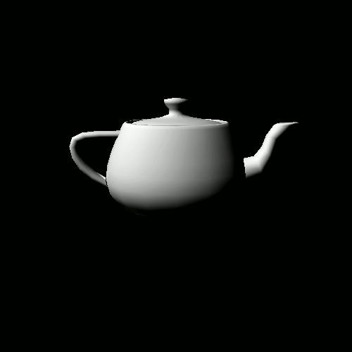
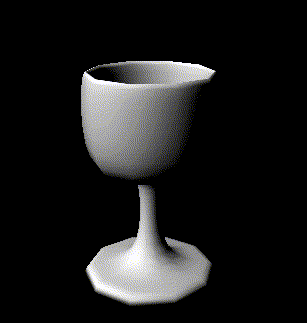

# Teapot

This is a little silly project which I've done during my studies. 
The goal is to render an object from OFF format writing only to single pixels. 
This is of course highly inefficient, using CPU for graphical calculations concerning 
shading and resterization.

Of course, since it is somehow Hello World application for rendering, one of the main models
used for it was Utah Teapot! This here:

It can be used for various other objects as long as they are in OFF format, for example a cup 
from the same set as the pot:

Not a lot more going on here, but it was fun doing it. Maybe sometime 
I'll get around adding antialiasing to all of that...
